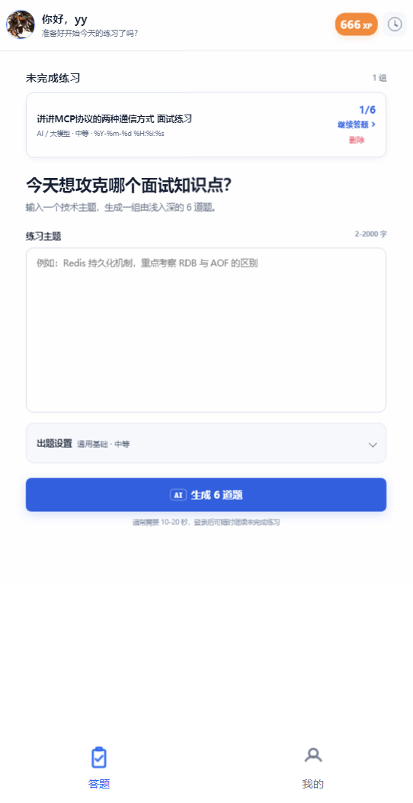
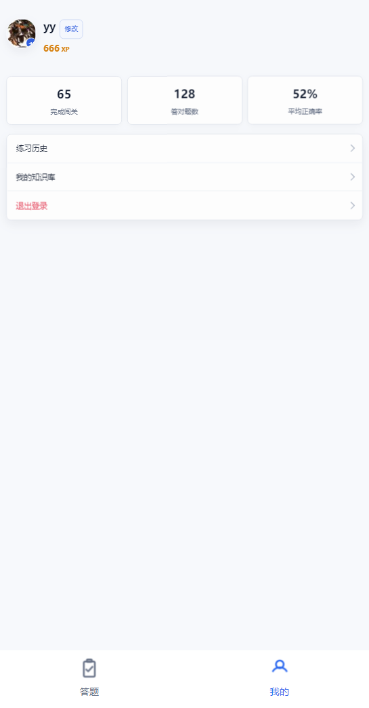
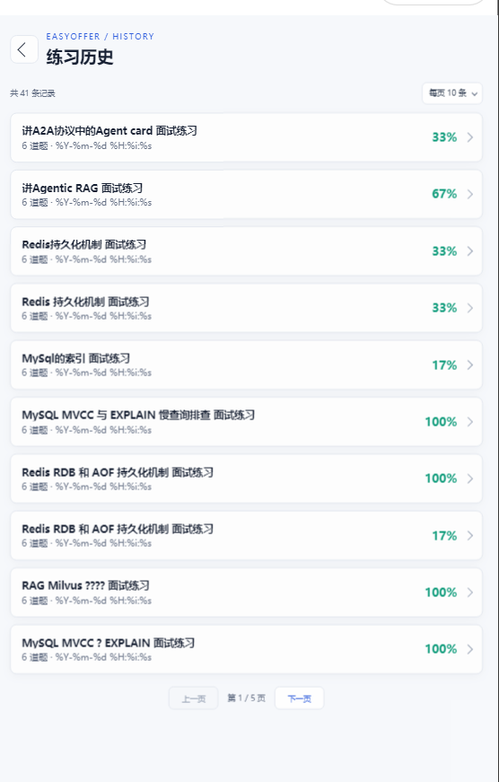
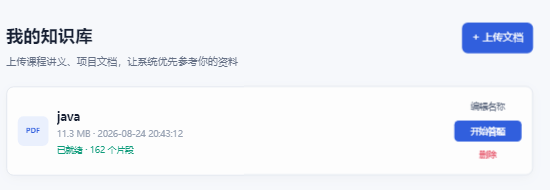
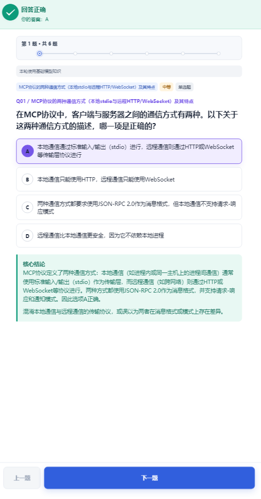
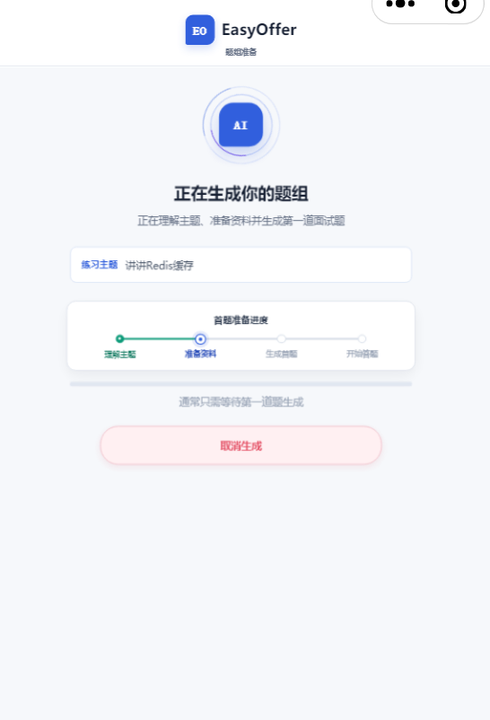
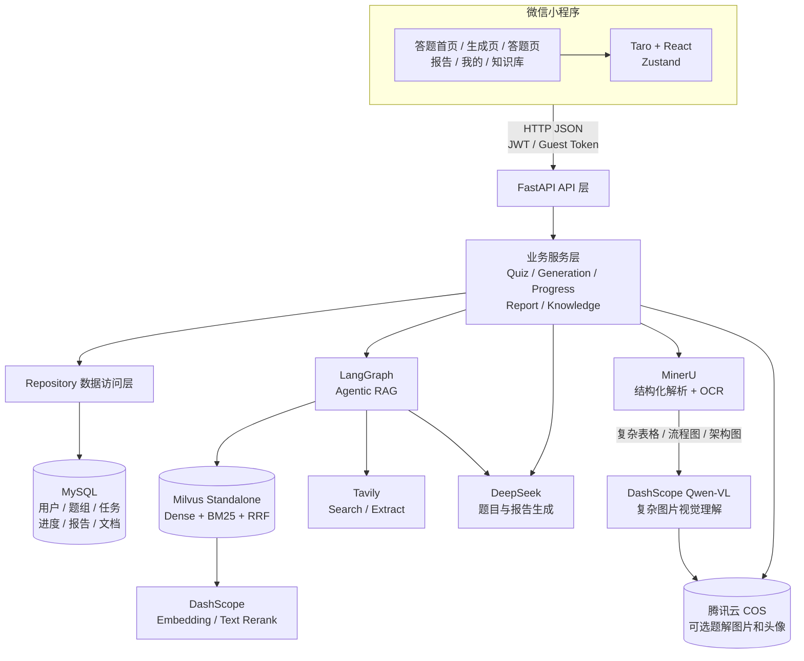
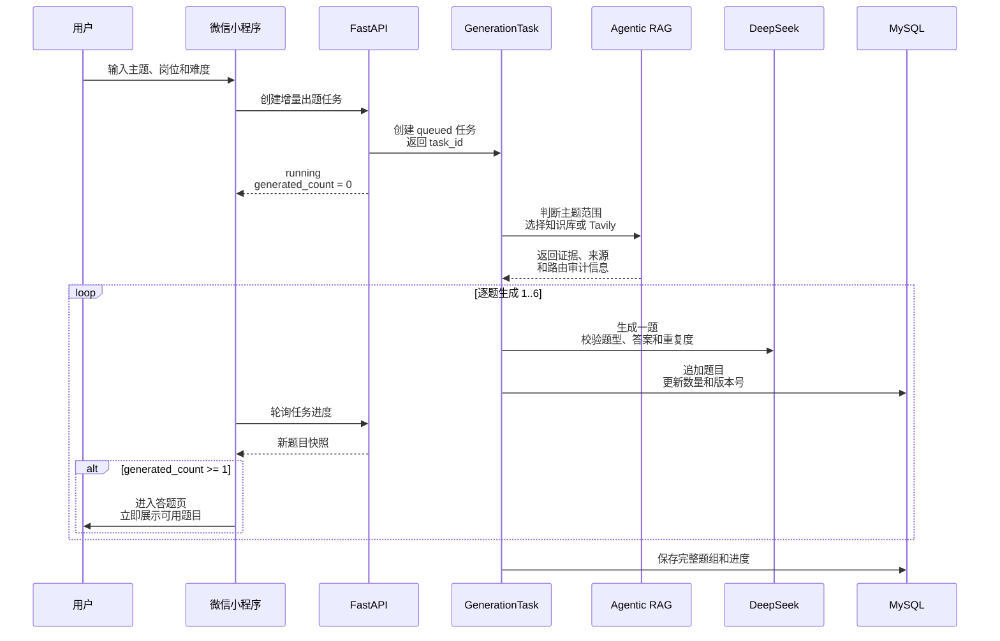
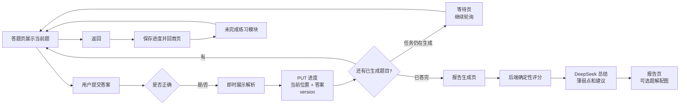
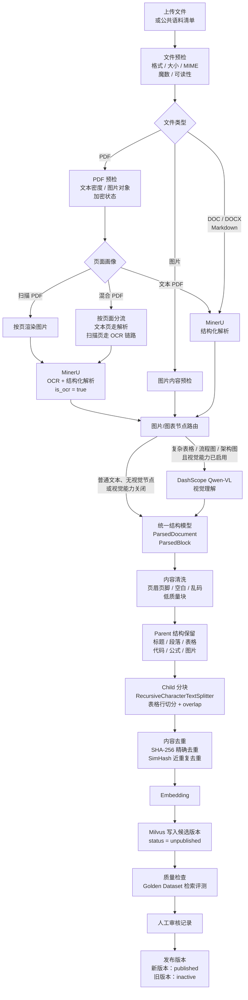

# EasyOffer

EasyOffer 是面向中文程序员求职者的技术面试刷题微信小程序。用户输入一个技术主题，系统结合岗位和难度生成一组由浅入深的面试题；用户逐题作答后获得确定性评分和 AI 复盘报告。项目重点是“高质量、可信的面试学习与评估”，同时支持个人文档知识库和联网资料补充。

> 项目状态：EasyOffer V1.0 已完成开发、自动化测试、微信开发者工具验收与 OpenSpec 归档，当前进入维护阶段。

## 核心功能

### 1. AI 面试题生成

- 支持通用基础、后端、前端、AI/大模型、数据与算法、测试/运维、移动端、安全工程等方向。
- 支持基础、中等、进阶难度。
- 每轮 6 题，题型按约束生成：4 道单选、1 道多选、1 道判断。
- 生成前会做主题安全检查和“是否属于程序员面试内容”的范围判断。
- 使用异步任务 + 轮询；后端逐题生成并持久化，首题准备好后前端立即进入答题页，剩余题目在答题过程中继续生成。
- 模型返回会经过题型、答案、字段和题目重复度校验；单题异常时使用受约束的本地兜底题，避免整轮任务直接中断。

### 2. Agentic RAG 检索

- 使用 LangGraph 编排受策略约束的检索 Agent。
- 公共资料使用 Milvus Standalone；个人资料使用按用户隔离的 Milvus 集合。
- Milvus 采用 Dense + 原生 BM25 的混合召回，使用 RRF 融合候选，再调用 DashScope 重排序。
- URL 输入使用 Tavily Extract，技术关键词使用 Tavily Search；联网失败会记录降级原因并回退到基础模型生成。
- Agent 受工具白名单、调用次数、轮数、超时和上下文长度限制，不能越权访问其他用户的资料。

### 3. 个人知识库

- 支持上传 PDF、DOC、DOCX、PPT、PPTX、XLS、XLSX、HTML、Markdown 以及 PNG/JPG 图片；实际解析能力由 MinerU 和本地降级解析器共同决定。
- 上传阶段记录文件大小、扩展名、MIME、魔数和可读性，拒绝空文件、损坏文件和加密 PDF。
- 文档处理状态和上传进度可在小程序中查看，支持重试、重命名、删除。
- 个人文档可直接发起“只基于该文档”的练习；该模式不会混入公共知识库或联网资料，证据不足时允许基础模型补充。

### 4. 答题、断点续答与历史

- 答题页支持单选、多选、判断；多选采用答案集合完全匹配。
- 每次切题都会保存当前位置、答案记录和版本号。
- 返回答题页后可以继续未完成练习；首页展示未完成列表，可继续、生成报告或删除。
- 登录用户的练习历史、逐题结果和报告可长期查看；游客仅保留设备本地会话并受额度限制。

### 5. 复盘报告与题解配图

- 后端确定性计算得分、正确率和逐题状态，AI 负责总结、薄弱知识点和复习建议。
- 报告展示用户答案、标准答案、选项解释、知识点、常见误区和后续建议。
- 对适合图示的题解可异步生成流程图、时序图、ER 图、状态图、思维导图等配图；生图或对象存储失败不会阻塞答题和报告。

### 6. 用户系统

- 微信 `wx.login` + `jscode2session` 登录，后端签发 JWT。
- 支持昵称、头像选择和头像裁剪上传。
- 记录 XP、完成题组数、答对题数、平均正确率和练习历史。
- 主题文本接入微信内容安全检查；游客与登录用户使用不同的数据源和权限策略。

## 界面截图

<table>
  <tr>
    <td align="center"><strong>答题首页</strong><br></td>
    <td align="center"><strong>个人中心</strong><br></td>
    <td align="center"><strong>练习历史</strong><br></td>
  </tr>
  <tr>
    <td align="center"><strong>个人知识库</strong><br></td>
    <td align="center"><strong>答题页</strong><br></td>
    <td align="center"><strong>题目生成</strong><br></td>
  </tr>
</table>

## 系统架构



后端采用模块化单体结构：路由层负责鉴权和请求校验，Service 层编排业务，Repository 层访问 MySQL，`llm`、`research`、`corpus`、`media` 分别封装模型、检索、知识库和媒体能力。

## 核心业务流程

### 主题出题与逐题生成



### 答题、报告和断点续答



### 知识库构建流程



说明：PDF 上传后先由本地预检判断页面是否缺少文本层；扫描页和混合 PDF 的扫描页会把 `is_ocr=true` 传给 MinerU，由 MinerU 完成 OCR 并输出结构化结果。MinerU 的 JSON/Markdown 结果随后转换为项目内部的 `ParsedDocument`、`ParsedBlock`，统一字段后才能复用后续清洗、结构恢复、分块和存储逻辑。对于复杂表格、流程图、架构图等视觉内容，系统再按节点类型和上下文调用 DashScope Qwen-VL 做视觉理解；该增强链路由 `DOCUMENT_VISUAL_ENABLED` 控制，关闭或调用失败时保留可追溯的降级块，不阻塞文本知识库构建。

## RAG 关键实现

1. **召回**：Milvus Standalone 同时执行向量召回和原生 BM25，扩大候选覆盖面。
2. **融合**：使用 RRF 融合不同召回通道的排名，避免直接比较不同量纲的分数。
3. **过滤**：按 `published_only`、岗位、用户和文档 ID 做权限与版本过滤。
4. **重排序**：对较宽的候选集调用 DashScope Text Rerank，随后做最低相关性阈值过滤。
5. **Parent 恢复**：Child 命中后按 `parent_id + document_version + corpus_version` 恢复完整上下文和来源信息。
6. **路由**：Agent 根据 URL、用户身份、是否指定个人文档和当前证据情况决定工具；工具调用失败可降级到基础模型。

## 知识库治理与评估

- 公共语料通过 Manifest 管理来源、文档版本、许可状态和目标 `corpus_version`。
- `preview` 只解析、切分和质量检查；`ingest` 将候选分块写入 Milvus，但保持 `unpublished`。
- 通过 `evaluate` 运行 Golden Dataset 检索评测，当前指标包括 Hit@K、MRR、nDCG、知识覆盖、重复率、岗位污染、来源追溯、Parent 恢复和延迟。
- 审核记录以 YAML 保存并校验版本、审核人、结论和抽样记录；通过后才允许 `publish`。
- 发布时先激活新版本、停用旧版本并执行冒烟检查；失败会回滚并生成报告。
- 项目包含 RAGAS 全量评估入口，可对真实语料运行 Context Precision、Context Recall、Faithfulness、Answer Relevancy 等生成质量指标。RAGAS 是离线评估流程，不会在普通用户请求中同步执行。

## 项目结构

```text
easyoffer/
├─ backend/
│  ├─ app/api/v1/routes/       # FastAPI 路由
│  ├─ app/services/            # 题目、任务、进度、报告、知识库服务
│  ├─ app/repositories/        # MySQL 数据访问
│  ├─ app/llm/                 # DeepSeek 适配
│  ├─ app/research/            # LangGraph、Milvus、Tavily、证据处理
│  ├─ app/corpus/              # MinerU、OCR/视觉、分块、去重、评估、发布
│  ├─ app/media/               # 图片生成与 COS
│  ├─ tests/                   # 后端 TDD 测试
│  └─ pyproject.toml
├─ frontend/
│  ├─ src/pages/               # 首页、生成、答题、报告、我的、历史、知识库
│  ├─ src/services/            # API 与认证存储
│  ├─ src/store/               # Zustand 会话与认证状态
│  └─ package.json
├─ docs/                       # 运维、Milvus、RAG 与评估文档
├─ openspec/                   # 需求变更记录
└─ *.png                       # 微信开发者工具与原型截图
```

## API 入口

所有接口前缀为 `/api/v1`，登录接口返回 JWT，受保护接口通过 `Authorization: Bearer <token>` 鉴权；游客生成任务使用 `X-Guest-Token`。

| 模块 | 主要接口 |
| --- | --- |
| 健康检查 | `GET /health` |
| 一次性出题 | `POST /quiz/generate` |
| 增量出题任务 | `POST /quiz/generation-tasks`、`GET /quiz/generation-tasks/{task_id}` |
| 任务控制 | `PUT /quiz/generation-tasks/{task_id}/progress`、`POST .../retry`、`POST .../cancel` |
| 报告 | `POST /report/generate` |
| 进度 | `GET/PUT/DELETE /user/quizzes/{quiz_id}/progress`、`GET /progress/incomplete` |
| 用户 | `POST /user/login`、`GET/PUT /user/profile`、`POST /user/avatar` |
| 历史 | `GET /user/quizzes`、`GET /user/quizzes/{quiz_id}` |
| 个人知识库 | `GET/POST /knowledge/documents`、`PUT/PATCH/DELETE /knowledge/documents/{document_id}` |

## 本地运行

### 后端

要求 Python 3.11+、MySQL 8+、Milvus Standalone。复制 `backend/.env.example` 为 `backend/.env`，填写数据库、JWT、DeepSeek、DashScope、Tavily 和 Milvus 配置；密钥只保存在本地 `.env`，不要提交到 Git。

```powershell
cd backend
python -m pip install -e ".[dev]"
python -m uvicorn app.main:app --reload --host 127.0.0.1 --port 8000
```

健康检查：`GET http://127.0.0.1:8000/api/v1/health`。

### 前端

```powershell
cd frontend
npm install
npm run dev:weapp
```

将 `frontend/dist` 导入微信开发者工具。开发工具中配置合法的小程序 AppID；本地 API 地址通过项目现有配置指向 `http://127.0.0.1:8000/api/v1`。

## 测试与质量门禁

```powershell
cd backend
python -m pytest -q
python -m compileall -q app

cd ..\frontend
npm run typecheck
npm run test:frontend
npm run build:weapp
```

公共知识库治理命令在 `backend` 目录执行：

```powershell
python -m app.corpus.cli preview <manifest.yaml>
python -m app.corpus.cli ingest <manifest.yaml>
python -m app.corpus.cli evaluate <golden.yaml> <corpus_version>
python -m app.corpus.cli approve <corpus_version> --reviewer <name> --review-file <review.yaml>
python -m app.corpus.cli publish <corpus_version>
```

## 隐私与提交规范

- `.env`、API Key、JWT 密钥、数据库密码、COS 密钥均不提交。
- 提交前检查 `git status` 和 `git diff --check`，确认没有运行产物、用户上传文档和带敏感字段的日志。
- 评估报告可以提交脱敏后的指标和结构化结果，不提交第三方文档全文。

## 相关文档

- [公共知识库运维手册](docs/public-corpus-runbook.md)
- [公共知识库架构](docs/public-corpus-architecture.md)
- [Milvus 运维说明](docs/milvus-operations.md)
- [RAG 检索与评估](backend/docs/rag-retrieval.md)
- [评估开发过程](backend/docs/rag-evaluation-development-process.md)
