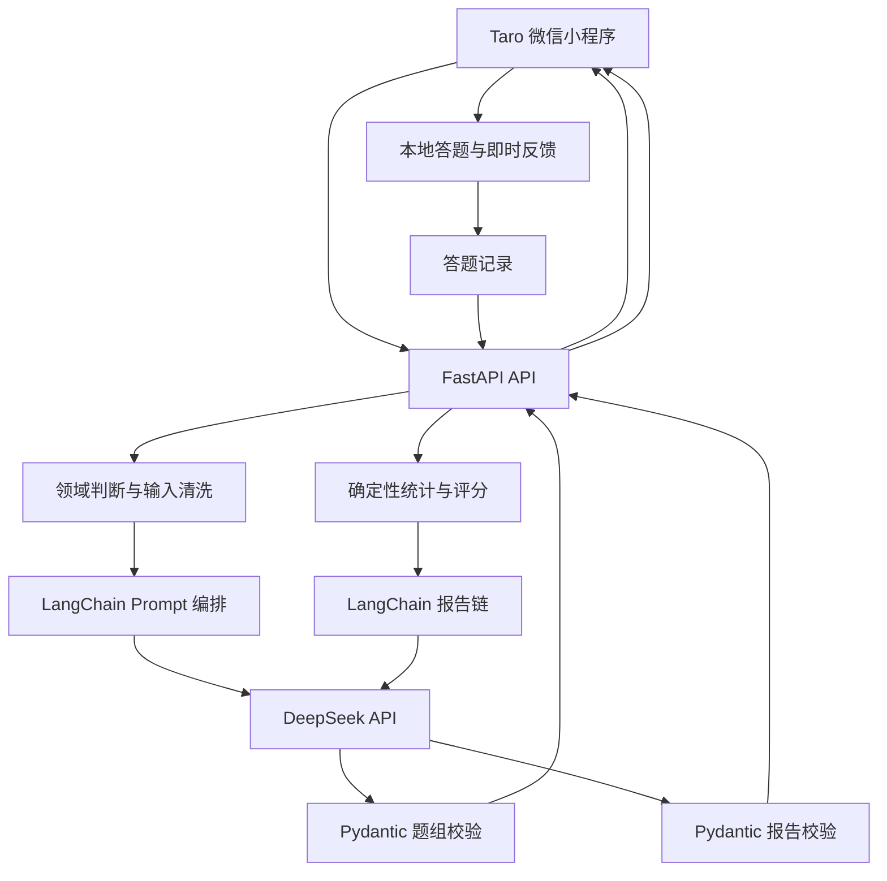

# 《EasyOffer 技术面试刷题小程序》方案设计文档

## 1. 文档目标

本文档用于指导 EasyOffer 从 0 到 1 完成 MVP 方案设计与实施落地，重点解决以下问题：

1. 明确微信小程序前端技术选型，并给出可执行的推荐结论。
2. 围绕核心业务闭环设计整体架构：用户输入面试知识点 => AI 生成题目 => 用户答题 => AI 生成分析报告。
3. 给出后端技术方案、DeepSeek 接入方式、核心 Prompt、接口协议、领域数据模型和分阶段开发路径。
4. 收敛首版范围，区分“现在就做”和“后续再做”，避免登录、数据库、搜索等外围能力阻塞核心链路。

本文档默认遵循以下前提：

- 产品面向中国大陆中文用户。
- 产品只服务准备程序员技术面试的人群。
- 首版输入固定为纯文本知识点或技术描述。
- 前端采用 `Taro 4.x + React 18 + TypeScript + Zustand`。
- 后端采用 `FastAPI + Python 3.11+ + Pydantic v2`。
- 大模型采用 DeepSeek，首选 `deepseek-chat`。
- AI 接入采用 `LangChain + langchain-openai`，底层使用 OpenAI 兼容协议。
- MVP 不以前置联网搜索、用户系统、数据库和多模态为重点。
- MVP 第一目标不是功能齐全，而是最短路径跑通面试刷题闭环。

---

## 2. 需求收敛与 MVP 边界

### 2.1 产品目标

EasyOffer 不是一个覆盖任意知识领域的通用学习工具，也不是传统固定题库。它是一个面向程序员技术面试的 AI 刷题工具：用户输入正在准备的面试知识点，系统将内容转换为短时闯关题，并在答题后给出即时讲解和复盘报告。

用户价值主要来自三件事：

1. 用户不需要在大型题库中搜索，可以围绕当前知识点立即开始练习。
2. 通过逐题作答和即时讲解，检验自己是否真正理解，而不是只看过资料。
3. 通过答题统计、信心校准和薄弱点建议完成一次面试复盘。

### 2.2 MVP 只保留的核心能力

MVP 只保留以下能力：

1. 用户输入一个程序员技术面试知识点、一句话或一段技术描述。
2. 系统判断输入是否属于程序员技术面试范围；非技术内容给出明确提示。
3. 后端调用 DeepSeek 生成 6 道结构化题目，题型以单选、判断为主，可包含 1 道多选题。
4. 用户逐题作答，并选择“确定、不太确定、猜的”三档信心。
5. 每题提交后立即展示正确答案、错误选项原因和知识讲解。
6. 全部题目完成后，系统生成正确率、信心校准、薄弱知识点和下一步建议。

首轮质量承诺只覆盖：

- 通用计算机基础：计算机网络、操作系统、数据库、数据结构与算法。
- Java 后端。
- 前端。

其他主流岗位可以后续扩展，但不纳入首版质量承诺。

### 2.3 明确不前置的能力

以下能力保留到后续版本，不纳入 MVP 首轮开发：

1. 微信授权登录、用户注册和账号体系。
2. MySQL、PostgreSQL 或 CloudBase 正式持久化。
3. 全网搜索、网页抓取和来源证据链。
4. PDF、Word、网页链接和视频解析。
5. RAG 私有知识库和向量数据库。
6. 错题本、长期学习历史和跨设备同步。
7. 社交 PK、排行榜和复杂分享裂变。
8. 语音面试、数字人和视频能力。
9. 在线代码运行和判题沙箱。
10. 支付、会员和复杂商业化链路。

### 2.4 方案设计原则

1. 先验证 AI 面试题质量，再开发外围系统。
2. 先做纯文本链路，再扩展搜索和多源输入。
3. 先使用无数据库或轻状态接口，再建设用户中心。
4. 先保证模型输出结构稳定，再优化动画和视觉包装。
5. 分数由确定性代码计算，模型只负责题目和报告文案。
6. 报告只评价本轮答题表现，不预测 Offer 概率或真实面试结果。
7. 所有设计以“独立开发者能够快速实现和验证”为第一约束。

---

## 3. 小程序技术选型对比

小程序框架会直接影响开发效率、调试体验和后续扩展，因此需要在微信原生、Taro、uni-app 和 uni-app x 之间进行明确选择。

### 3.1 选型候选

本次重点比较以下四种方案：

1. 微信原生小程序。
2. Taro 4.x。
3. uni-app。
4. uni-app x。

### 3.2 对比维度

重点从以下维度比较：

- 学习和开发成本。
- 微信小程序适配程度。
- React 18 与 TypeScript 支持。
- 多端扩展能力。
- 生态成熟度。
- 组件与 NPM 依赖兼容性。
- 性能和调试体验。
- 对独立开发者的友好度。
- 对 EasyOffer MVP 的适配程度。

### 3.3 详细对比表

| 方案 | 技术栈 | 优势 | 劣势 | 适合场景 | 对本项目结论 |
|---|---|---|---|---|---|
| 微信原生小程序 | WXML / WXSS / JS / TS | 官方能力完整，兼容性最好，平台问题定位直接 | React 无法直接复用，多端扩展成本高 | 永远只做微信单端且强依赖原生能力 | 可用，但不是首选 |
| Taro 4.x | React / Vue + Taro API | React 与 TypeScript 工程化成熟，支持微信小程序和 H5，适合 VSCode + CLI | 仍需理解小程序运行限制和跨端差异 | 希望使用现代前端工具链并保留多端扩展 | **推荐** |
| uni-app | Vue 3 + uni API | 中文生态成熟，插件多，多端开发效率高 | 更偏 Vue 和 DCloud 生态，与既定 React 技术栈不一致 | 已有 Vue/uni-app 经验的团队 | 第二备选 |
| uni-app x | uts + uvue | 原生跨端性能潜力高 | 学习和工具链成本更高，MVP 收益有限 | 高性能 App 和原生跨端项目 | 不适合当前 MVP |

### 3.4 最新调研结论

1. `Taro 4.x` 仍适合使用 React 和 TypeScript 开发微信小程序。
2. 它符合 `VSCode + Taro CLI + 微信开发者工具` 的工作流。
3. uni-app 是成熟备选，但主线技术栈是 Vue，与本项目已确认的 React 18 不一致。
4. uni-app x 的核心优势偏向高性能原生跨端，不是当前刷题 MVP 的主要需求。
5. 微信原生兼容性最好，但会牺牲 React 工程复用和后续 H5 扩展能力。

### 3.5 最终推荐

**MVP 采用 `Taro 4.x + React 18 + TypeScript`。**

推荐理由：

1. 与已确认的前端技术栈一致。
2. 适合独立开发者使用 VSCode 和 CLI 快速开发。
3. 微信小程序支持成熟，可以使用微信开发者工具预览和真机调试。
4. 后续扩展 H5 时可以复用部分页面和领域逻辑。
5. 便于接入 ESLint、Prettier、TypeScript 和自动化测试。
6. 当前产品瓶颈是 AI 出题质量，不是极致原生渲染性能。

### 3.6 不推荐直接使用 uni-app x 的原因

1. 当前 MVP 不是性能瓶颈型产品。
2. `uts` 和 `uvue` 会增加学习、调试和排障成本。
3. 第三方组件和跨端样式的兼容判断更复杂。
4. 独立开发第一阶段应减少技术变量。

### 3.7 备选方案

如果未来开发者主要使用 Vue 3，或已经积累大量 uni-app 组件，可以重新评估 `uni-app Vue 3`。如果项目最终只维护微信单端且大量使用原生能力，则可以重新评估微信原生小程序。

---

## 4. 整体系统架构设计

### 4.1 架构目标

整体架构需要满足三件事：

1. 前端和后端可以围绕固定 JSON 契约并行开发。
2. AI 生成结果必须结构化，前端不能解析不稳定的自然语言文本。
3. 后续加入搜索、RAG、用户系统和数据库时，不需要推翻当前核心模块。

### 4.2 总体架构图



### 4.3 核心模块拆分

前端模块：

1. 首页输入模块。
2. 题目闯关模块。
3. 信心选择与即时反馈模块。
4. 报告展示模块。
5. Zustand 会话状态模块。
6. Taro.request 统一请求模块。

后端模块：

1. API 层：处理 HTTP 请求、参数校验和响应封装。
2. Service 层：编排领域判断、出题、评分和报告流程。
3. LangChain 编排层：维护 Prompt 模板和结构化输出链。
4. LLM 层：统一初始化 DeepSeek 客户端和调用参数。
5. 领域模型层：题组、题目、答题记录和报告结构。
6. 基础设施层：配置、日志、异常和内容过滤。

### 4.4 数据流设计

#### 流程一：生成题目

1. 用户输入面试知识点，并选择岗位和难度。
2. 前端调用生成题组接口。
3. 后端执行长度校验、领域判断和文本清洗。
4. 非程序员面试内容直接返回范围提示。
5. 后端使用 `ChatPromptTemplate` 组装出题 Prompt。
6. LangChain 通过 OpenAI 兼容接口调用 DeepSeek。
7. Pydantic 校验题量、选项和答案字段。
8. 后端返回标准题组 JSON。
9. 前端保存题组并进入答题页。

#### 流程二：用户答题

1. 前端展示当前题目和选项。
2. 用户选择答案和信心后提交。
3. 前端根据题组中的固定答案即时判题。
4. 前端展示正确答案、逐项解释和常见误区。
5. Zustand 记录答案、信心、是否正确和答题用时。
6. 全部题目完成后一次性提交答题记录。

#### 流程三：生成报告

1. 后端接收题组和答题记录。
2. 评分模块计算正确率、信心校准和薄弱标签。
3. 后端将确定性统计传给报告 Prompt。
4. DeepSeek 生成结构化复盘文案。
5. Pydantic 校验报告字段。
6. 前端展示本轮表现、薄弱点和下一步建议。

---

## 5. 技术栈设计

### 5.1 前端技术栈

- 框架：`Taro 4.x`。
- 视图库：`React 18`。
- 语言：`TypeScript`。
- 状态管理：`Zustand`。
- 请求方式：统一封装 `Taro.request`。
- UI 策略：自定义轻量组件，不在 MVP 引入重量级 UI 框架。
- 样式：`SCSS`。
- 构建工具：`Taro CLI + VSCode + 微信开发者工具`。
- 代码质量：`ESLint + Prettier`。

Zustand 负责保存跨页面状态：题组、当前题号、答题记录和报告。输入框、弹窗和临时加载状态仍使用 React 页面内状态。

### 5.2 后端技术栈

- Web 框架：`FastAPI`。
- 运行环境：`Python 3.11+`。
- 数据校验：`Pydantic v2`。
- 模型编排：`LangChain`。
- 模型适配：`langchain-openai`。
- Prompt 模板：`ChatPromptTemplate`。
- 结构化输出：`with_structured_output()` + Pydantic。
- 模型协议：OpenAI 兼容 API。
- 模型服务：DeepSeek。
- 配置管理：`pydantic-settings`。
- 日志：`structlog` 或标准 `logging`。
- 测试：`pytest`。

### 5.3 为什么选择 FastAPI

1. Pydantic 参数校验适合定义 AI 请求和响应结构。
2. 自动生成 OpenAPI 和 Swagger 文档，便于前后端联调。
3. 异步能力适合模型调用和后续扩展任务处理。
4. Python 的 AI SDK、文本处理和测试生态完整。
5. 对独立开发者而言，工程心智负担较低。

### 5.4 为什么使用 LangChain 作为正式接入层

本项目将 LangChain 作为 DeepSeek 的正式编排层，而不是可有可无的辅助库。

推荐原因：

1. `ChatPromptTemplate` 可以清晰组织系统消息、用户消息和变量。
2. `with_structured_output()` 可以将模型结果映射到 Pydantic Schema。
3. `langchain-openai` 的 `ChatOpenAI` 支持自定义 `base_url`，可以对接 DeepSeek 的 OpenAI 兼容接口。
4. 模型、温度、重试和结构化输出可以集中管理。
5. 后续切换模型或加入 RAG 时，调用层不需要散落修改。

使用边界：

1. MVP 只使用 `ChatPromptTemplate`、`ChatOpenAI` 和 `with_structured_output()`。
2. 不引入 Agent、LangGraph、自主工具调用或复杂 RAG。
3. 评分、正确率和信心校准仍由普通 Python 代码计算。
4. LangChain 负责调用编排，不承载全部业务逻辑。

---

## 6. 后端架构设计

### 6.1 推荐项目结构

```text
server/
  app/
    api/
      v1/
        routes/
          health.py
          quiz.py
          report.py
    core/
      config.py
      logging.py
      exceptions.py
    models/
      common.py
      quiz.py
      report.py
    services/
      topic_service.py
      quiz_service.py
      scoring_service.py
      report_service.py
    prompts/
      quiz_prompt.py
      report_prompt.py
    llm/
      model_factory.py
      quiz_chain.py
      report_chain.py
    utils/
      text_cleaner.py
      content_filter.py
      id_generator.py
    main.py
  tests/
    test_health_api.py
    test_quiz_api.py
    test_report_api.py
    test_prompt_contract.py
  pyproject.toml
  .env.example
```

### 6.2 分层职责

#### API 层

负责：

1. 请求参数校验。
2. 调用 Service。
3. 返回码和响应格式统一。
4. 错误码映射。
5. 请求级日志记录。

API 层不直接拼 Prompt，也不直接实例化 DeepSeek 客户端。

#### Service 层

负责：

1. 判断输入是否属于程序员技术面试。
2. 调用出题链或报告链。
3. 组织模型输入参数。
4. 调用评分服务计算确定性统计。
5. 对模型结果做业务兜底校验。
6. 组装接口响应对象。

#### LLM 层

负责：

1. 基于 `langchain-openai` 初始化 DeepSeek 对应的 `ChatOpenAI`。
2. 统一管理模型、温度、超时和重试配置。
3. 通过 `ChatPromptTemplate` 和 `with_structured_output()` 创建调用链。
4. 处理模型空响应、格式异常和输出截断。

#### Prompt 层

负责：

1. 维护版本化 Prompt 模板。
2. 管理 Prompt 所需变量。
3. 维护面试出题规则和报告规则。
4. 为后续 Prompt A/B Test 预留扩展点。

---

## 7. DeepSeek 接入方案

### 7.1 模型选择

MVP 推荐：

- 首选：`deepseek-chat`。
- 预留：`deepseek-reasoner`。

推荐理由：

1. 出题和报告主要要求稳定的结构化输出与合理成本。
2. `deepseek-chat` 适合标准内容生成和中文总结。
3. `deepseek-reasoner` 可用于后续高难题或复杂分析，不是 MVP 必需项。
4. 首版应减少模型变量，避免同时维护多套 Prompt。

### 7.2 接入方式

使用 `LangChain + langchain-openai` 对接 DeepSeek：

- 使用 `ChatOpenAI`。
- `base_url = https://api.deepseek.com`。
- `api_key = DEEPSEEK_API_KEY`。
- `model = deepseek-chat`。
- 使用 `ChatPromptTemplate` 构建消息。
- 使用 `with_structured_output()` 映射到 Pydantic 模型。

推荐代码形态：

```python
from langchain_openai import ChatOpenAI
from langchain_core.prompts import ChatPromptTemplate

llm = ChatOpenAI(
    model="deepseek-chat",
    base_url="https://api.deepseek.com",
    api_key=settings.deepseek_api_key,
    temperature=0.4,
    timeout=30,
    max_retries=1,
)

prompt = ChatPromptTemplate.from_messages(
    [
        ("system", "你是一名专业的程序员技术面试出题助手。"),
        ("user", "{user_input}"),
    ]
)

quiz_chain = prompt | llm.with_structured_output(QuizGenerateOutput)
```

API Key 只能保存在服务端环境变量中，不能写入小程序代码、Git 仓库或前端请求。

### 7.3 JSON 输出策略

结构化输出按以下策略实现：

1. LangChain 层优先使用 `with_structured_output()` 约束 Pydantic Schema。
2. Prompt 中仍明确要求只输出目标结构，不输出 Markdown 或额外说明。
3. 题组和报告分别使用独立 Pydantic 模型。
4. 服务层再次检查题量、选项、答案和必填字段。
5. `max_tokens` 根据题目数量设置，避免 JSON 被截断。
6. 如果当前 DeepSeek 模型与结构化输出模式存在兼容问题，则降级为 JSON 模式加 `model_validate_json()`。

### 7.4 可靠性设计

出题和报告链路必须增加以下兜底：

1. 一级校验：模型响应不能为空。
2. 二级校验：结构化输出必须映射到 Pydantic Schema。
3. 三级校验：题目数、选项数、正确答案和讲解必须完整。
4. 四级校验：题目不能明显重复，答案必须存在于选项中。
5. 五级兜底：失败后自动重试 1 次；仍失败则返回明确错误，不把脏数据交给前端。

### 7.5 调用参数建议

出题接口建议：

- temperature：`0.4`。
- timeout：`30s`。
- max_retries：`1`。
- max_tokens：根据 6 道题的实测结果设置。

报告接口建议：

- temperature：`0.5`。
- timeout：`30s`。
- max_retries：`1`。
- 使用独立报告链，不与出题 Prompt 混用。

参数只是初始值，应通过真实调用结果调整。模型名称、Prompt 版本和耗时需要写入日志，方便排查问题。

---

## 8. 核心 Prompt 设计

Prompt 直接决定首版体验。MVP 不追求复杂技巧，优先保证题目与报告稳定、结构化、可解析。

### 8.1 出题 Prompt 目标

模型根据用户输入的程序员面试知识点生成可直接渲染的题组 JSON，题目应覆盖：

1. 核心概念理解。
2. 常见误区辨析。
3. 工程场景判断。
4. 版本或边界条件。

### 8.2 出题 Prompt 设计原则

1. 明确题量为 6 题。
2. 明确题型比例，例如单选 4 道、多选 1 道、判断 1 道。
3. 明确每个输出字段。
4. 明确每题答案必须可判定。
5. 错误选项应对应真实面试误区。
6. 讲解适合移动端阅读，并解释错误选项为什么错。
7. 版本敏感内容必须写明版本或前提。
8. 禁止输出 Markdown、代码块或 JSON 之外的文字。

### 8.3 出题 Prompt 示例

```text
你是一名专业的程序员技术面试出题助手，请根据用户输入生成一组用于微信小程序刷题的题目。

要求：
1. 输入内容必须属于程序员技术面试范围；如果不属于，返回 supported=false 和提示信息。
2. 输出必须符合给定的结构化 Schema，不要输出额外说明。
3. 共生成 6 道题：4 道单选题、1 道多选题、1 道判断题。
4. 每道题包含：题目编号、题型、题干、选项、正确答案、详细讲解、错误选项讲解、知识点标签、难度和版本前提。
5. 题目应覆盖核心概念、工程场景、常见误区和边界条件。
6. 每道题必须有可判定答案，多选题必须明确答案数量。
7. 错误选项应来自真实常见误区，不能使用明显荒谬的干扰项。
8. 讲解使用简洁中文，适合小程序阅读。
9. 不预测用户面试通过率，不生成与主题无关的内容。

用户输入：{user_input}
目标岗位：{role}
难度：{difficulty}
```

### 8.4 报告 Prompt 目标

报告 Prompt 接收用户主题、题组、答题记录和由代码计算的统计结果，输出结构化复盘报告。

### 8.5 报告 Prompt 输出内容

1. 本轮得分和正确率。
2. 稳定掌握的知识点。
3. 侥幸答对的知识点。
4. 高风险误区。
5. 普通知识缺口。
6. 三句面试知识总结。
7. 下一步复习建议。
8. 评估限制说明。

### 8.6 报告 Prompt 示例

```text
你是一名程序员技术面试学习复盘助手，请根据本轮答题记录生成结构化复盘报告。

要求：
1. 输出必须符合给定的结构化 Schema。
2. 分数、正确率和信心校准以服务端统计结果为准，不得重新计算或修改。
3. 分析必须基于真实题目和答题记录，不得编造用户行为。
4. 区分稳定掌握、侥幸答对、高风险误区和普通知识缺口。
5. 建议必须具体到知识点，避免“继续努力”等空泛内容。
6. 语言简洁，适合移动端阅读。
7. 不预测 Offer 概率、真实面试结果、薪资或职级。

用户主题：{topic}
目标岗位：{role}
题组摘要：{quiz_json}
答题记录：{answer_records}
统计结果：{score_summary}
```

### 8.7 Prompt 版本管理建议

Prompt 从首版开始进行版本化：

- `quiz_prompt_v1`。
- `quiz_prompt_v2`。
- `report_prompt_v1`。
- `topic_classifier_prompt_v1`。

每次修改 Prompt 时记录版本、修改原因和测试结果。题组和报告响应中保留 `prompt_version`，避免后续无法定位生成差异。

---

## 9. API 接口设计

MVP 接口保持简单，使前后端能够并行开发，不引入任务队列、数据库和复杂鉴权。

### 9.1 接口列表

#### 1. 健康检查

- `GET /api/v1/health`

用途：检查 FastAPI 服务是否正常启动。

响应示例：

```json
{
  "code": 0,
  "message": "ok",
  "data": {
    "status": "ok"
  }
}
```

#### 2. 生成题组

- `POST /api/v1/quiz/generate`

请求体：

```json
{
  "user_input": "Java HashMap 在 JDK 8 中的扩容机制",
  "role": "java-backend",
  "difficulty": "medium",
  "question_count": 6
}
```

响应体：

```json
{
  "code": 0,
  "message": "ok",
  "data": {
    "quiz_id": "quiz_xxx",
    "title": "Java HashMap 扩容机制",
    "summary": "围绕 JDK 8 HashMap 扩容、阈值和索引迁移生成的面试题组",
    "role": "java-backend",
    "difficulty": "medium",
    "questions": []
  }
}
```

非程序员技术面试输入：

```json
{
  "code": 4001,
  "message": "当前只支持程序员技术面试相关知识点",
  "data": {
    "supported": false,
    "examples": ["TCP 三次握手", "Java HashMap", "React useEffect"]
  }
}
```

#### 3. 生成复盘报告

- `POST /api/v1/report/generate`

请求体：

```json
{
  "quiz_id": "quiz_xxx",
  "topic": "Java HashMap 扩容机制",
  "role": "java-backend",
  "questions": [],
  "answer_records": [
    {
      "question_id": "q1",
      "selected_answers": ["B"],
      "confidence": "unsure",
      "is_correct": true,
      "duration_ms": 3200
    }
  ]
}
```

响应体：

```json
{
  "code": 0,
  "message": "ok",
  "data": {
    "score": 4,
    "total": 6,
    "accuracy": 66.7,
    "stable_points": ["扩容触发条件"],
    "lucky_points": ["索引迁移规则"],
    "misconceptions": ["扩容容量变化"],
    "knowledge_gaps": ["负载因子与阈值"],
    "summary": ["...", "...", "..."],
    "advice": ["...", "..."],
    "limitations": "本报告仅反映本轮题目表现，不代表真实面试通过概率。"
  }
}
```

### 9.2 为什么不单独设计“提交单题答案接口”

MVP 不建议每道题都请求后端判题：

1. 正确答案已经在题组 JSON 中，前端可以即时反馈。
2. 每题请求后端会增加接口数量和网络等待。
3. 当前目标是验证出题质量和复盘质量，不是考试防作弊。
4. 全部题目完成后，一次性提交答题记录即可生成报告。

如果后续加入认证、排行榜或多人竞技，再改为服务端判题。

### 9.3 统一响应规范

成功响应：

```json
{
  "code": 0,
  "message": "ok",
  "data": {}
}
```

错误响应：

```json
{
  "code": 5001,
  "message": "题组生成失败，请稍后重试",
  "data": null
}
```

建议错误码：

| 错误码 | 含义 |
|---:|---|
| 4001 | 非程序员技术面试内容 |
| 4002 | 输入为空或长度不合法 |
| 4003 | 岗位或难度参数不合法 |
| 5001 | 题组生成失败 |
| 5002 | 报告生成失败 |
| 5003 | 模型输出结构不合法 |

---

## 10. 领域数据模型设计

本节只定义 MVP 业务对象，不展开正式数据库表设计。

### 10.1 Quiz

```json
{
  "quiz_id": "quiz_xxx",
  "title": "Java HashMap 扩容机制",
  "summary": "题组摘要",
  "topic": "Java HashMap 在 JDK 8 中的扩容机制",
  "role": "java-backend",
  "difficulty": "medium",
  "questions": [],
  "model_version": "deepseek-chat",
  "prompt_version": "quiz_prompt_v1"
}
```

### 10.2 Question

```json
{
  "id": "q1",
  "type": "single|multiple|judge",
  "stem": "题干",
  "options": [
    {"key": "A", "text": "选项 A"},
    {"key": "B", "text": "选项 B"}
  ],
  "answer": ["B"],
  "explanation": "正确答案讲解",
  "option_explanations": {
    "A": "选项 A 错误原因",
    "B": "选项 B 正确原因"
  },
  "knowledge_point": "扩容触发条件",
  "misconception": "常见误区",
  "difficulty": "medium",
  "version_context": "JDK 8"
}
```

### 10.3 AnswerRecord

```json
{
  "question_id": "q1",
  "selected_answers": ["B"],
  "confidence": "sure|unsure|guess",
  "is_correct": true,
  "duration_ms": 3200
}
```

信心与结果的映射：

| 答题结果 | 信心 | 报告分类 |
|---|---|---|
| 正确 | 确定 | 稳定掌握 |
| 正确 | 不太确定 / 猜的 | 侥幸答对 |
| 错误 | 确定 | 高风险误区 |
| 错误 | 不太确定 / 猜的 | 普通知识缺口 |

### 10.4 Report

```json
{
  "score": 4,
  "total": 6,
  "accuracy": 66.7,
  "stable_points": ["..."],
  "lucky_points": ["..."],
  "misconceptions": ["..."],
  "knowledge_gaps": ["..."],
  "summary": ["...", "...", "..."],
  "advice": ["...", "..."],
  "limitations": "本报告仅反映本轮题目表现，不代表真实面试通过概率。"
}
```

### 10.5 MVP 阶段存储策略

MVP 按以下顺序实现：

1. 第一阶段：不使用数据库，题组、答题记录和报告保存在 Zustand 与 Taro Storage 中。
2. 第二阶段：如需后端调试记录，可保存到本地 JSON 或 SQLite。
3. 第三阶段：验证产品价值后，再设计正式用户、题组、答题记录和报告表。

该顺序可以避免数据库和登录系统阻塞核心 AI 闭环。

---

## 11. 前端页面与交互设计

首版不重点展开复杂视觉系统，只保留能够支撑核心流程的页面和交互。

### 11.1 页面列表

1. 首页：`pages/index/index`。
2. 闯关页：`pages/quiz/index`。
3. 报告页：`pages/report/index`。

### 11.2 首页

功能：

1. 输入面试知识点或技术描述。
2. 选择岗位：通用、Java 后端、前端。
3. 选择难度：基础、中等、进阶。
4. 点击“开始生成”。
5. 展示生成中状态。
6. 非技术输入显示范围提示。
7. 生成失败时支持重试。

### 11.3 闯关页

功能：

1. 展示题目、当前进度和剩余题数。
2. 支持单选、多选和判断题。
3. 支持“确定、不太确定、猜的”信心选择。
4. 用户提交后立即展示对错和讲解。
5. 展示每个错误选项的错误原因。
6. 提交后不允许修改答案。
7. 记录正确数、答题用时和信心。

### 11.4 报告页

功能：

1. 展示得分和正确率。
2. 展示稳定掌握、侥幸答对、高风险误区和知识缺口。
3. 展示三句知识总结。
4. 展示下一步复习建议。
5. 展示“仅代表本轮表现”的评估限制。
6. 提供“再练一轮”按钮。
7. 预留分享海报按钮，但不作为 MVP 核心验收项。

### 11.5 交互原则

1. 单题反馈必须即时，不要求全部完成后才知道对错。
2. 每题讲解可以折叠，避免移动端页面过长。
3. AI 生成期间必须有明确 loading 状态。
4. 提交按钮在未选答案或未选信心时不可用。
5. 页面退出后通过 Zustand 和 Taro Storage 恢复当前题号。
6. 首版保持简单，不加入排行榜、复杂动画和会员入口干扰流程。

---

## 12. 核心业务流程与开发思路

### 12.1 MVP 实施顺序

推荐顺序：

1. 先跑通后端“生成题组接口”。
2. 再使用静态 JSON 完成小程序闯关页。
3. 再接入真实题组接口。
4. 再实现报告生成接口和报告页。
5. 最后联调首页，形成端到端闭环。

不应先做：

1. 用户系统。
2. 正式数据库。
3. 全网搜索和 RAG。
4. 分享海报。
5. 多端适配细节。

### 12.2 为什么必须先验证 AI 出题接口

这个项目的核心不是题目展示页面，而是 DeepSeek 能否稳定生成适合程序员面试、可以直接作答、答案可判定并且讲解清晰的结构化题组。

如果题目质量和 JSON 稳定性没有通过验证，页面、登录和数据库都没有实际价值。因此第一阶段应优先使用 Swagger、pytest 或 Postman 反复测试出题接口。

### 12.3 推荐验证顺序

#### Step 1

使用 Swagger 调通 `POST /api/v1/quiz/generate`。

验收标准：

1. 输入技术面试主题能返回 6 道题。
2. 非技术主题能返回范围提示。
3. 返回结构可以通过 Pydantic 校验。
4. 每道题答案存在于选项中。
5. 讲解不是简单重复答案。
6. 失败时返回统一错误结构。

#### Step 2

前端使用静态题组 JSON 完成闯关页。

验收标准：

1. 单选、多选和判断题可以正确渲染。
2. 答题后立即反馈。
3. 信心选择可以记录。
4. 多题切换流程顺畅。
5. 页面退出后可以恢复当前进度。

#### Step 3

首页和闯关页接入真实生成题组接口。

验收标准：

1. 首页输入后能进入闯关页。
2. loading、失败和重试状态完整。
3. DeepSeek 返回的数据能够直接渲染。

#### Step 4

完成 `POST /api/v1/report/generate` 和报告页。

验收标准：

1. 分数与前端答题结果一致。
2. 信心校准分类正确。
3. 报告会随答题结果变化。
4. 总结和建议不是固定模板。
5. 报告不预测真实面试结果。

---

## 13. 分阶段开发计划

### Phase 0：环境搭建

目标：

- 建立前后端基础工程。
- 接通 DeepSeek API。
- 确定目录、配置和代码规范。

交付物：

1. Taro 4.x + React 18 + TypeScript 前端工程。
2. Zustand Store 和 Taro.request 基础封装。
3. FastAPI 后端工程。
4. `.env` 和 pydantic-settings 配置。
5. 基础日志和健康检查接口。

### Phase 1：后端 AI 出题接口

目标：优先验证最核心的 AI 出题能力。

交付物：

1. `POST /api/v1/quiz/generate`。
2. 输入领域判断。
3. 出题 Prompt V1。
4. DeepSeek 结构化输出。
5. Pydantic 题组校验。
6. 重试和统一错误处理。

验收：

1. 连续生成 10 次，接口没有未处理异常。
2. 返回给前端的题组 100% 通过 Schema 校验。
3. 技术主题和非技术主题处理结果正确。
4. 至少人工检查 TCP、Java HashMap、React Hooks 三个主题。

### Phase 2：小程序闯关页

目标：完成答题、信心选择和即时讲解流程。

交付物：

1. 首页输入页。
2. 闯关页。
3. Zustand 会话状态。
4. 本地判题逻辑。
5. 即时讲解和进度展示。
6. Taro Storage 进度恢复。

### Phase 3：报告生成

目标：打通答题结束后的复盘闭环。

交付物：

1. 确定性评分和信心校准模块。
2. `POST /api/v1/report/generate`。
3. 报告 Prompt V1。
4. Pydantic 报告校验。
5. 报告展示页。

### Phase 4：完整闭环联调

目标：打通从输入知识点到复盘报告的完整链路。

交付物：

1. 首页调用真实题组接口。
2. 闯关页承接真实数据。
3. 报告页展示真实统计和 AI 文案。
4. loading、空状态、错误状态和重试。
5. 微信开发者工具和真机验证。

核心验收流程：

```text
输入 Java HashMap
  -> 通过技术面试领域判断
  -> DeepSeek 生成 6 道题
  -> 用户逐题作答并选择信心
  -> 每题立即展示讲解
  -> 完成后生成复盘报告
```

### Phase 5：增强能力

只有核心闭环稳定后才进入增强阶段。

候选交付物：

1. 全网搜索和可信来源。
2. 错题本和复习提醒。
3. 本地 SQLite 或正式数据库。
4. 微信登录和跨设备同步。
5. 分享海报。
6. 文档和网页输入。
7. 短答案与 AI 追问。
8. 更多技术岗位支持。
