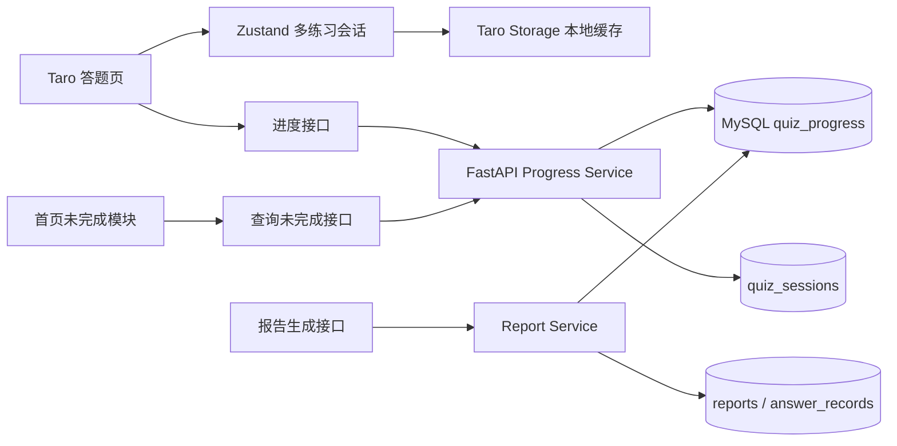

# 《EasyOffer 未完成练习与断点续答》方案设计文档

> 文档版本：v1.0  
> 编写日期：2026-08-23  
> 关联需求：`未完成练习需求分析文档.md`  
> 适用范围：Taro 微信小程序、FastAPI 后端、MySQL 用户系统

## 1. 文档目标

本文档用于指导 EasyOffer 实现“答题过程中安全离开、下次继续答题”的能力，解决当前返回按钮清空会话、进度丢失的问题。

本方案覆盖：

1. 答题进度的本地保存和服务端持久化。
2. 答题页返回、切换 Tab 和小程序重新打开时的恢复流程。
3. 首页“未完成练习”模块。
4. `in_progress`、`ready_for_report`、`completed`、`abandoned` 状态管理。
5. 报告生成成功、失败和重复请求的处理。
6. 用户隔离、幂等保存、并发更新和 TDD 验证。

本次不改变已有的 AI 出题、逐题判题和报告展示主流程，不引入新的题型或重新出题能力。

## 2. 现状与设计约束

### 2.1 当前实现

当前项目已经具备：

- `Taro + React + TypeScript + Zustand` 微信小程序前端。
- `FastAPI + Python` 后端。
- `MySQL` 用户系统和历史记录表。
- `quiz_sessions` 保存题组内容。
- `answer_records` 在报告生成时保存整组答题记录。
- `reports` 保存已生成报告。
- 前端 `session.ts` 目前只维护一条本地会话，`reset()` 会删除该会话。

### 2.2 主要问题

1. `answer_records` 只有在报告生成时才保存，无法表达答题进行中的状态。
2. 当前会话模型只支持一组练习，无法同时保留多组未完成练习。
3. 返回答题页时调用 `reset()`，会删除题组、当前题号和已提交答案。
4. 首页没有读取未完成练习的接口和展示模块。
5. 报告失败时缺少“已答完、等待重新生成报告”的持久化状态。

### 2.3 设计约束

1. 已完成的历史记录和进行中的练习必须分开管理。
2. 只有点击“提交答案”后的记录才视为已提交数据。
3. 保存失败不能静默丢失进度；本地缓存必须作为短期兜底。
4. 未登录用户仍可继续使用核心答题流程；登录用户获得服务端持久化和跨设备恢复。
5. 报告成功和 XP 结算必须幂等，重复点击不能重复加 XP。
6. 所有查询必须按当前登录用户过滤，不能通过 `quiz_id` 越权读取其他用户数据。

## 3. 总体架构



数据职责如下：

| 数据 | 负责内容 |
| --- | --- |
| `quiz_sessions` | 一组题目的不可变快照、主题、岗位和难度 |
| `quiz_progress` | 进行中的题号、已提交答案和练习状态 |
| `answer_records` | 完成答题后用于历史统计的最终答题记录 |
| `reports` | 报告生成成功后的最终报告 |
| Zustand / Taro Storage | 当前设备的即时状态和服务端失败时的本地兜底 |

## 4. 练习状态机

### 4.1 状态定义

| 状态 | 含义 | 首页展示 | 允许的操作 |
| --- | --- | --- | --- |
| `in_progress` | 已生成题目，尚未答完 | 是 | 继续答题、放弃 |
| `ready_for_report` | 所有题目已提交，报告尚未成功生成 | 是 | 生成报告、放弃 |
| `completed` | 报告已成功保存 | 否 | 查看历史报告 |
| `abandoned` | 用户主动放弃 | 否 | 不可继续 |

状态流转：

```text
生成题组 -> in_progress -> ready_for_report -> completed
                 \------------------------------> abandoned
```

### 4.2 状态变更规则

1. 题组生成成功并保存后创建 `in_progress` 记录。
2. 每次提交答案后更新答题记录和 `current_index`。
3. 最后一题提交成功后由后端将状态改为 `ready_for_report`。
4. 报告写入成功后，后端在同一事务中将状态改为 `completed`。
5. 报告生成失败只记录日志和错误信息，状态保持 `ready_for_report`。
6. 普通进度保存请求不能把 `completed` 回退为 `in_progress`。
7. `abandoned` 由用户主动操作产生，P1 阶段采用软删除，不物理删除历史数据。

## 5. 数据库设计

### 5.1 新增 `quiz_progress` 表

在现有 `quiz_sessions`、`answer_records` 和 `reports` 基础上新增独立进度表：

| 字段 | 类型 | 约束 | 说明 |
| --- | --- | --- | --- |
| `id` | BIGINT UNSIGNED | PK | 自增主键 |
| `quiz_id` | VARCHAR(80) | UNIQUE、FK | 题组业务 ID |
| `user_id` | BIGINT UNSIGNED | FK、INDEX | 所属用户 |
| `status` | VARCHAR(32) | NOT NULL | 练习状态 |
| `current_index` | INT UNSIGNED | NOT NULL | 下次进入时的题目索引 |
| `answer_records_json` | JSON | NOT NULL | 已提交的答题记录 |
| `answered_count` | INT UNSIGNED | NOT NULL | 已提交题数，便于列表查询 |
| `total_questions` | INT UNSIGNED | NOT NULL | 总题数 |
| `version` | INT UNSIGNED | NOT NULL | 乐观锁版本号 |
| `last_error` | VARCHAR(500) | NULL | 最近一次报告失败原因摘要 |
| `created_at` | DATETIME | NOT NULL | 创建时间 |
| `updated_at` | DATETIME | NOT NULL | 最近保存时间 |
| `completed_at` | DATETIME | NULL | 完成时间 |
| `abandoned_at` | DATETIME | NULL | 放弃时间 |

建议建表 SQL：

```sql
CREATE TABLE IF NOT EXISTS quiz_progress (
  id BIGINT UNSIGNED NOT NULL AUTO_INCREMENT,
  quiz_id VARCHAR(80) NOT NULL,
  user_id BIGINT UNSIGNED NOT NULL,
  status VARCHAR(32) NOT NULL DEFAULT 'in_progress',
  current_index INT UNSIGNED NOT NULL DEFAULT 0,
  answer_records_json JSON NOT NULL,
  answered_count INT UNSIGNED NOT NULL DEFAULT 0,
  total_questions INT UNSIGNED NOT NULL,
  version INT UNSIGNED NOT NULL DEFAULT 1,
  last_error VARCHAR(500) NULL,
  created_at DATETIME NOT NULL DEFAULT CURRENT_TIMESTAMP,
  updated_at DATETIME NOT NULL DEFAULT CURRENT_TIMESTAMP ON UPDATE CURRENT_TIMESTAMP,
  completed_at DATETIME NULL,
  abandoned_at DATETIME NULL,
  PRIMARY KEY (id),
  UNIQUE KEY uq_quiz_progress_quiz_id (quiz_id),
  KEY idx_quiz_progress_user_status_updated (user_id, status, updated_at),
  CONSTRAINT fk_quiz_progress_quiz
    FOREIGN KEY (quiz_id) REFERENCES quiz_sessions (quiz_id)
    ON DELETE CASCADE ON UPDATE CASCADE,
  CONSTRAINT fk_quiz_progress_user
    FOREIGN KEY (user_id) REFERENCES users (id)
    ON DELETE CASCADE ON UPDATE CASCADE
) ENGINE=InnoDB DEFAULT CHARSET=utf8mb4 COLLATE=utf8mb4_unicode_ci;
```

### 5.2 为什么不直接扩展 `answer_records`

`answer_records` 当前代表一组已经完成并用于历史统计的最终答案。若把进行中的数据直接写入该表，会导致历史列表误认为练习已完成，也无法清晰表达报告失败状态。因此用 `quiz_progress` 保存增量进度，报告成功后再写入或更新现有历史表。

### 5.3 数据完整性

后端保存前必须校验：

1. `quiz_id` 属于当前 `user_id`。
2. `question_id` 存在于题组快照中。
3. 同一个 `question_id` 只能保留最新一次提交记录。
4. `current_index` 范围为 `0..total_questions`。
5. `answered_count` 等于去重后的答题记录数量。
6. `ready_for_report` 必须满足 `answered_count == total_questions`。
7. `completed` 必须同时存在报告记录。

### 5.4 与现有历史数据兼容

1. 历史列表查询应只展示已经存在报告的记录，或明确关联 `quiz_progress.status = 'completed'` 的记录，不能把 `in_progress` 和 `ready_for_report` 当作已完成历史。
2. 对上线前已经存在的 `quiz_sessions`，如果没有 `quiz_progress` 记录，继续允许按现有报告接口查看历史，不要求强制回填进度。
3. 对上线前已经生成报告的题组，不自动创建未完成记录。
4. 新流程写入报告后，同时写入 `answer_records`、`reports` 和 `quiz_progress.completed`，保证新旧历史页面都能正常读取。

## 6. 后端模块设计

### 6.1 目录调整

```text
backend/app/
  api/v1/routes/
    quiz.py                 # 生成题组时创建进度
    report.py               # 报告完成时更新进度
    progress.py             # 未完成练习接口
  models/
    progress.py             # 请求、响应和状态模型
  repositories/
    progress_repository.py  # quiz_progress CRUD
    user_repository.py      # 保留用户及历史查询
  services/
    progress_service.py     # 校验、状态流转、幂等和并发控制
```

### 6.2 生成题组改造

现有 `POST /api/v1/quiz/generate` 保持请求和响应兼容。用户已登录时：

1. 保存 `quiz_sessions`。
2. 创建同一 `quiz_id` 的 `quiz_progress`，状态为 `in_progress`。
3. 初始 `current_index = 0`、`answered_count = 0`、答案数组为空。
4. 使用 `INSERT ... ON DUPLICATE KEY UPDATE` 保证重复回调不创建重复进度。

未登录时只保存前端本地会话，不创建没有用户归属的服务端进度。

### 6.3 进度保存服务

`ProgressService.save_progress()` 负责：

1. 校验用户和题组归属。
2. 校验答案记录和题目 ID。
3. 合并同一题的重复提交记录。
4. 根据答题数量计算新状态。
5. 使用 `version` 做乐观锁更新。
6. 返回服务端最新进度，供前端纠正本地状态。

### 6.4 报告完成改造

现有 `POST /api/v1/report/generate` 保持原有业务响应。报告生成成功后，数据库事务依次执行：

1. 锁定当前用户的进度记录。
2. 检查是否已经存在报告；存在则直接返回幂等结果，不重复结算 XP。
3. 写入 `answer_records` 和 `reports`。
4. 将 `quiz_progress.status` 更新为 `completed`，写入 `completed_at`。
5. 仅首次写入报告时增加 XP。

任一步骤失败都回滚事务，进度仍保持 `ready_for_report`，用户可以稍后重试。

如果请求来自没有 `quiz_progress` 的旧题组，服务端保留现有 `save_report` 兼容分支：完成历史照常写入，XP 仍按已有幂等规则结算，但不影响新进度表的数据约束。

## 7. 接口设计

所有接口均使用当前 JWT 鉴权方式，并且只允许访问当前用户的数据。

### 7.1 查询未完成练习

`GET /api/v1/user/quizzes/incomplete`

响应：

```json
{
  "items": [
    {
      "quiz_id": "quiz_123",
      "title": "Redis 持久化机制",
      "topic": "Redis 持久化",
      "role": "backend",
      "difficulty": "medium",
      "status": "in_progress",
      "answered_count": 2,
      "total_questions": 6,
      "current_index": 2,
      "updated_at": "2026-08-23 19:30:00"
    }
  ]
}
```

查询条件为当前用户的 `in_progress` 或 `ready_for_report`，按 `updated_at DESC, id DESC` 排序。

### 7.2 查询单组练习进度

`GET /api/v1/user/quizzes/{quiz_id}/progress`

响应包含题组快照、当前索引、已提交答案和状态：

```json
{
  "quiz_id": "quiz_123",
  "status": "in_progress",
  "current_index": 2,
  "answered_count": 2,
  "total_questions": 6,
  "answer_records": [],
  "version": 4,
  "updated_at": "2026-08-23 19:30:00"
}
```

### 7.3 保存练习进度

`PUT /api/v1/user/quizzes/{quiz_id}/progress`

请求：

```json
{
  "current_index": 2,
  "answer_records": [
    {
      "question_id": "q1",
      "selected_answers": ["B"],
      "duration_ms": 3200
    }
  ],
  "version": 3
}
```

规则：

1. 客户端不直接提交 `status`，状态由后端根据答案数量决定。
2. 版本不匹配返回 `409 Conflict` 和服务端最新进度。
3. 最后一题提交后返回 `ready_for_report`。
4. 对同一请求重复提交必须得到一致结果。

### 7.4 放弃练习

`DELETE /api/v1/user/quizzes/{quiz_id}/progress`

该接口作为 P1 功能实现，服务端将状态改为 `abandoned`，不删除已完成历史，不再出现在未完成列表中。

### 7.5 错误响应

| HTTP 状态 | 场景 |
| ---: | --- |
| 401 | 登录失效或 token 缺失 |
| 404 | 题组或当前用户的进度不存在 |
| 409 | 版本冲突、状态已完成或重复操作 |
| 422 | 题号、答案或索引不合法 |
| 503 | 数据库暂时不可用 |

## 8. 前端方案设计

### 8.1 Zustand 会话模型

将当前单会话模型升级为多练习模型，建议使用 `easyoffer-session-v2`：

```ts
interface PracticeSession {
  quiz: Quiz
  currentIndex: number
  answers: AnswerRecord[]
  status: 'in_progress' | 'ready_for_report'
  version: number
  updatedAt: number
}

interface SessionState {
  activeQuizId: string | null
  practices: Record<string, PracticeSession>
  setQuiz: (quiz: Quiz) => void
  recordAnswer: (quizId: string, answer: AnswerRecord) => void
  advanceQuestion: (quizId: string) => void
  saveProgress: (quizId: string) => Promise<void>
  restorePractice: (quizId: string) => Promise<void>
  removePractice: (quizId: string) => void
}
```

迁移策略：

1. 首次加载时读取 `easyoffer-session-v1`。
2. 如果存在旧单会话且包含题组，则转换为 `practices[quiz_id]`。
3. 写入 v2 后删除旧 key，避免两套状态互相覆盖。
4. 以后所有页面只读取 v2 store。

### 8.2 保存时机

采用“本地立即保存、服务端异步同步、关键离开操作等待确认”的策略：

1. 点击提交答案后，先更新 Zustand 和 Taro Storage。
2. 提交服务端进度请求；成功后更新 `version`。
3. 点击左上角返回时，先执行一次同步保存并等待结果。
4. 切换 Tab、页面卸载或小程序隐藏时，至少保证本地缓存已经写入；服务端同步使用可取消的短请求。
5. 只保存已提交答案，不保存用户尚未提交的选项。

服务端保存失败时：

- 本地数据保留。
- 答题页提示“进度暂存本地，网络恢复后重试”。
- 不在未确认保存时静默删除会话。
- 下次首页加载时重试同步。

### 8.3 答题页返回流程

新的 `leaveQuiz()` 流程：

```text
点击左上角返回
  -> 禁用按钮，避免重复点击
  -> 保存本地状态
  -> 同步服务端进度
  -> 成功：reLaunch 到答题首页
  -> 失败：停留当前页面并提示重试
```

返回流程禁止调用 `reset()`。只有报告成功或用户确认放弃时，才从本地活动练习集合移除。

### 8.4 恢复流程

首页点击未完成练习后：

1. 先从本地 store 找到对应 `quiz_id`，立即进入恢复态。
2. 同时请求服务端最新进度。
3. 服务端版本更新时，以服务端数据覆盖本地。
4. `in_progress` 跳转答题页并定位 `current_index`。
5. `ready_for_report` 跳转报告生成页，不要求重复答题。
6. 题组不存在或数据损坏时显示错误态，不进入空白页。

## 9. 首页未完成练习模块

### 9.1 加载时机

首页 `useDidShow` 时执行：

1. 已登录：调用未完成练习接口并刷新列表。
2. 未登录：读取本地 `practices` 并展示当前设备的记录。
3. 退出登录时清理内存中的用户列表，不能显示上一个用户的数据。

### 9.2 展示内容

每条记录展示主题、岗位、难度、进度、最近保存时间和操作按钮：

- `in_progress`：显示“继续答题”。
- `ready_for_report`：显示“生成报告”。

没有记录时不显示虚假示例数据，也不增加占据主要空间的空白卡片。

### 9.3 多条记录

首版最多展示最近 3 条，提供“查看全部”入口时复用历史列表样式。列表排序由后端完成，前端只负责展示，不实现新的排序规则。

## 10. 报告生成与历史记录

1. 最后一题提交成功后，答题页跳转报告生成页。
2. 报告生成页根据 `quiz_id` 读取当前活动练习，不再依赖只有一条的全局 session。
3. 报告成功后刷新本地和服务端状态，删除活动练习，保留历史报告。
4. 报告失败时保留 `ready_for_report`，首页按钮变为“重新生成报告”。
5. 重复进入报告页时，后端优先返回已有报告，前端不重复增加 XP。

历史列表接口需要同步调整查询条件：只将已有报告或 `completed` 进度的题组计入“已完成练习”；未完成练习只能通过 `/user/quizzes/incomplete` 返回，避免首页和历史页出现重复记录。

## 11. 游客与登录合并

### 11.1 首版策略

P0 只保证：登录用户服务端持久化，游客当前设备本地恢复。游客跨设备恢复不作承诺。

### 11.2 登录后的合并策略（P1）

登录成功后将本地活动练习逐条提交到合并接口或进度接口：

1. 服务端不存在同 `quiz_id`：创建进度。
2. 服务端存在且本地版本更新：以更新时间较新的记录为准。
3. 服务端已 `completed`：丢弃本地活动记录，保留已完成历史。
4. 合并成功后删除本地重复记录。

合并过程必须按用户身份执行，不能把游客数据写入其他账户。

## 12. 并发与幂等设计

### 12.1 进度保存

使用 `version` 乐观锁：

```sql
UPDATE quiz_progress
SET current_index = %s,
    answer_records_json = %s,
    answered_count = %s,
    status = %s,
    version = version + 1,
    updated_at = CURRENT_TIMESTAMP
WHERE quiz_id = %s AND user_id = %s AND version = %s
```

影响行数为 0 时返回 `409`，前端重新读取服务端最新状态。

### 12.2 报告生成

报告保存使用数据库事务和 `SELECT ... FOR UPDATE`：

1. 锁定进度或报告记录。
2. 已有报告则直接返回已有数据。
3. 没有报告则同时写入答题记录、报告和完成状态。
4. XP 只在首次写入报告的分支增加。

## 13. 安全与权限

1. 所有进度接口要求 JWT。
2. 查询条件必须同时包含 `quiz_id` 和 `user_id`。
3. 不接受前端提交的 `user_id`、`status`、`completed_at` 和 XP 字段。
4. 答案记录仍需服务端根据题组快照校验，不能相信前端的正确率字段。
5. 日志中不打印完整答案、token 或用户隐私信息。
6. 题组和进度接口继续沿用现有用户隔离和登录失效处理。

## 14. TDD 与验证方案

### 14.1 后端单元测试

必须先写测试再实现以下行为：

1. 创建题组时创建 `in_progress` 记录。
2. 提交一题后正确保存 `current_index` 和答案。
3. 重复提交同一题不会增加 `answered_count`。
4. 最后一题提交后状态变为 `ready_for_report`。
5. 报告成功后状态变为 `completed`。
6. 报告失败后状态仍为 `ready_for_report`。
7. 重复报告请求不重复增加 XP。
8. 版本冲突返回 `409`，不覆盖新数据。
9. 用户 A 不能读取或修改用户 B 的进度。
10. `completed` 记录不能被普通保存请求回退。

### 14.2 API 集成测试

使用 FastAPI TestClient 覆盖：

1. `GET /user/quizzes/incomplete` 的排序和状态过滤。
2. `GET /user/quizzes/{quiz_id}/progress` 的用户隔离。
3. `PUT /user/quizzes/{quiz_id}/progress` 的参数校验和幂等。
4. `DELETE` 放弃流程及历史数据保留。
5. 登录失效、数据库不可用和题组不存在等错误响应。

### 14.3 前端验证

1. TypeScript 类型检查和 Taro 微信构建。
2. 单会话 v1 到多会话 v2 的迁移测试。
3. 提交答案后退出，重新进入仍定位正确题目。
4. 切换“我的”再返回答题，活动练习不丢失。
5. 多组练习可以分别恢复。
6. 报告失败后首页出现“重新生成报告”。
7. 退出登录后不展示上一个用户的未完成列表。

### 14.4 微信开发者工具验收

按真实流程验证：

```text
登录
  -> 生成 Redis 练习
  -> 提交第 1、2 题
  -> 点击左上角返回
  -> 首页看到 2/6
  -> 重新进入并定位第 3 题
  -> 完成答题
  -> 报告成功后未完成模块移除
```

同时验证：网络断开、重复点击返回、重复点击生成报告、小程序重新打开和切换账号。

## 15. 分阶段开发计划

### Phase 1：数据库和领域模型

1. 新增 `quiz_progress` 表和迁移脚本。
2. 新增 Pydantic 状态、进度请求和响应模型。
3. 编写 repository 单元测试。

### Phase 2：后端进度接口

1. 实现创建、查询、保存和放弃进度。
2. 接入用户鉴权和用户隔离。
3. 实现版本冲突和重复请求处理。
4. 完成 API 集成测试。

### Phase 3：报告链路改造

1. 最后一题后生成 `ready_for_report` 状态。
2. 报告成功与历史写入放入同一事务。
3. 增加报告失败保留和 XP 幂等测试。

### Phase 4：前端多会话和恢复

1. 将 `session.ts` 升级为多练习 store。
2. 实现 v1 本地数据迁移。
3. 修改答题页返回，不再调用 `reset()`。
4. 增加本地保存、服务端同步和冲突处理。

### Phase 5：首页模块和真实联调

1. 首页增加未完成练习模块。
2. 接入登录用户接口和游客本地数据。
3. 在微信开发者工具和真机完成端到端验收。

### Phase 6：增强项

1. 游客登录后的本地进度合并。
2. 多设备冲突提示和全部未完成练习列表。
3. 放弃练习、恢复失败诊断和运营监控。

## 16. 验收与回滚

### 16.1 发布验收

- [ ] 返回答题页不会清空活动练习。
- [ ] 首页能展示当前用户的未完成练习。
- [ ] 继续答题能定位到正确题目。
- [ ] 已提交答案和题目顺序不变。
- [ ] 报告失败后可以重试。
- [ ] 报告成功后练习从未完成列表移除并进入历史。
- [ ] 用户之间数据完全隔离。
- [ ] 重复请求不会重复创建记录或增加 XP。

### 16.2 回滚策略

1. 数据库新增表不删除旧表，前端可以通过配置开关暂时隐藏首页模块。
2. 若进度接口异常，前端保留本地 v2 数据并允许用户继续当前设备答题。
3. 报告完成逻辑回滚时，不回滚已有 `reports` 和 XP 数据，使用幂等查询避免重复结算。
4. 修复完成后重新同步本地进度，不要求用户重新生成题目。

## 17. 方案结论

本方案采用“现有题组表 + 独立进度表 + 多练习前端 store”的设计：

1. `quiz_sessions` 保证题目快照稳定。
2. `quiz_progress` 表达进行中和待报告状态。
3. `answer_records`、`reports` 继续承担完成历史职责。
4. 本地缓存保证即时体验，MySQL 保证登录用户的跨设备恢复。
5. 版本号、事务和幂等规则保证返回、重试和并发操作不会破坏数据。

该方案优先解决用户最关心的“离开后还能继续答题”，并且与当前 EasyOffer 用户系统和核心 AI 流程兼容，后续可以在不推翻现有结构的前提下扩展错题本、学习统计和复习计划。
